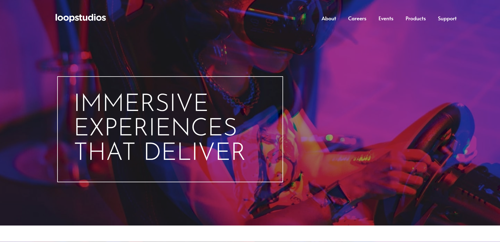

# Frontend Mentor - Loopstudios landing page solution

This is a solution to the [Loopstudios landing page challenge on Frontend Mentor](https://www.frontendmentor.io/challenges/loopstudios-landing-page-N88J5Onjw).

### Links

- Live Site URL: [GitHubPage](https://thethomasy.github.io/Loopstudios-Landing-Page/)

### Screenshots

  
  

## My process

My first steps was building the mobile version of the site. The layout is simpler as all the elements stack. The navigation bar is collapsed on smaller screens and the menu button opens a fullscreen page with the navigation links. On larger screens the links move to the navigation bar.

The desktop layout is slightly more complicated. The hero text and introduction sections are offset and a lot of work went into making sure that they look good across all screen widths. At larger screens the project tiles use grid, instead of flexbox, as it handles 2-dimensional layout more efficiently.

The last step was adding animation to the changing elements. The mobile navigation page uses a simple fade in and height change. For the open/close icon of the navigation I used the following design [Menu "Hamburger" Icon Animations by Jesse Couch](https://codepen.io/designcouch/pen/Atyop) and tweaked them to fit the page. Very useful resource.

### Built with

- HTML
- SASS
- Flexbox
- Grid
- Mobile-first workflow
- JS

## Author

- Frontend Mentor - [@TheThomasY](https://www.frontendmentor.io/profile/TheThomasY)
