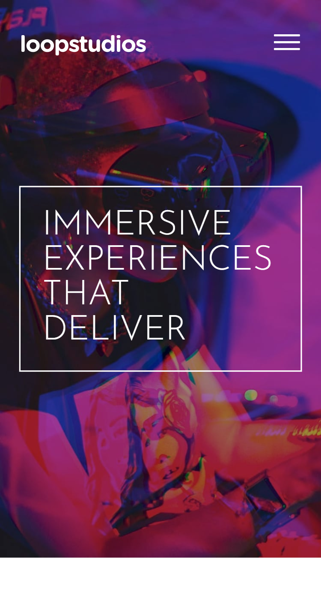

<h1 align="center">Loopstudios Landing Page</h1>

An example of a company landing page. The site is fully responsive, looks great at all screen widths, and includes some subtle and clean animation. I built this using HTML and styled it with Sass.

## Links 🌟

- Live site: [Try it out here 💻](https://thethomasy.github.io/Loopstudios-Landing-Page/ 'Live View') 

- This is a solution to the [Loopstudios landing page challenge on Frontend Mentor](https://www.frontendmentor.io/challenges/loopstudios-landing-page-N88J5Onjw).

## Screenshots 📷

  
<!--    -->

## Built With 🛠

- HTML
- [Sass](https://sass-lang.com/)

## Future Updates 🎁

- [ ] Add load animation to page items, e.g 'creations' elements

## Changelog

- **[1.0.0] 17/01/22 Deployment**: Site deployed to GitHub Pages

## Author 🧑

**Tom Young**

- [Github Profile 👨‍💻](https://github.com/TheThomasY)
- [Email ✉](mailto:tomyoungdev@gmail.com?subject=Hi 'Hi!')
- [LinkedIn 💼](https://www.linkedin.com/in/tom-young5555/)
- [Dev.to 🖊](https://dev.to/thetomy)

Give a ⭐️ if you like this project!

